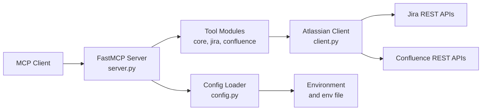

# Atlassian MCP Server

## Table of Contents

1. [Overview](#overview)
2. [Key Capabilities](#key-capabilities)
3. [Quick Start](#quick-start)
4. [Architecture](#architecture)
5. [Documentation Map](#documentation-map)

## Overview

`atlassian-mcp-server` is a Python Model Context Protocol server that exposes Jira and Confluence capabilities as MCP tools for Atlassian Cloud and on-premise Server or Data Center deployments.

The server provides:

- core Atlassian account and connectivity tools
- Jira metadata, query, issue lifecycle, template, clone, agile, service management, forms, development, and attachment tools
- Confluence page, search, comment, label, user, and attachment tools
- toolset-based visibility controls for safer read-only or read-write deployments

## Key Capabilities

### Core

- `atlassian_check_connection`: verify the active Jira and Confluence configuration
- `atlassian_get_myself`: read the authenticated Atlassian account profile

### Jira

- Query and discovery: build JQL, validate JQL, search issues, inspect fields, statuses, issue types, projects, and templates
- Issue lifecycle: read, create, update, delete, comment, worklog, transition, clone, and create from templates
- Delivery workflows: boards, sprints, service desk queues, watchers, forms, development metadata, and attachments
- Full reference: [documentation/tools.md](documentation/tools.md)

### Confluence

- Content workflows: search pages, read pages, create or update pages, inspect children, comments, labels, users, and attachments
- File workflows: list, download, upload, filter, and delete attachments and images
- Full reference: [documentation/tools.md](documentation/tools.md)

## Quick Start

1. Install dependencies.

```bash
uv sync
```

2. Create and populate your secrets file.

```env
ATLASSIAN_ENV_FILE=C:\Users\<you>\.mcp-secrets\atlassian.env
```

3. Run the test suite.

```bash
uv run pytest
```

4. Start the MCP server.

```bash
uv run atlassian-mcp-server
```

Or build and run it on Docker Desktop:

```bash
$env:ATLASSIAN_HOST_ENV_FILE = "C:/Users/<you>/.mcp-secrets/atlassian.env"
uv run poe docker-build
uv run poe docker-up
```

For the complete setup guide, see [documentation/installatiion.md](documentation/installatiion.md).

## Architecture



A deeper implementation walkthrough is available in [documentation/implementation.md](documentation/implementation.md).

## Documentation Map

| Document | Purpose |
| --- | --- |
| [documentation/installatiion.md](documentation/installatiion.md) | Canonical installation and runtime setup guide |
| [documentation/installation.md](documentation/installation.md) | Compatibility pointer to the canonical installation guide |
| [documentation/environment-variables.md](documentation/environment-variables.md) | Full environment-variable reference with defaults and examples |
| [documentation/dependencies.md](documentation/dependencies.md) | Major runtime, development, and build dependencies |
| [documentation/implementation.md](documentation/implementation.md) | Architecture, component responsibilities, and data flow |
| [documentation/tools.md](documentation/tools.md) | Full MCP tool reference by area |
| [documentation/tests.md](documentation/tests.md) | Test inventory, setup, and assertion summary |