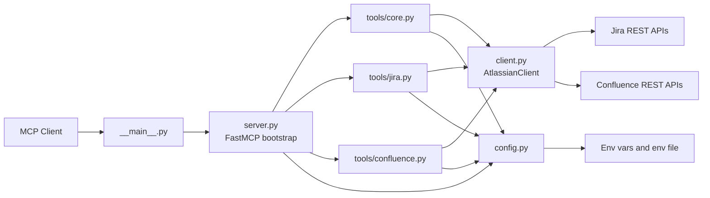

# Implementation

## Table of Contents

1. [Overview](#overview)
2. [Architecture](#architecture)
3. [Key Components](#key-components)
4. [Data Flow](#data-flow)
5. [Design Decisions and Trade-Offs](#design-decisions-and-trade-offs)
6. [Related Documentation](#related-documentation)

## Overview

`atlassian-mcp-server` is a Python Model Context Protocol server that exposes Jira and Confluence operations as MCP tools.

At a high level, the implementation is split into four layers:

- Runtime entrypoints that bootstrap the server and transport.
- Tool registration modules that define MCP tool handlers.
- A shared Atlassian API client that performs HTTP requests and normalizes retries and errors.
- Configuration loading that resolves environment variables, auth mode, deployment mode, and visible toolsets.

## Architecture

## Key Components

### `src/atlassian_mcp_server/__main__.py`

This is the CLI entrypoint. It delegates directly to `server.main()` so the package can be launched with the installed console script or `python -m`.

### `src/atlassian_mcp_server/server.py`

This file owns the FastMCP server instance and the server-wide behavior.

Responsibilities:

- Construct the `FastMCP` application.
- Register tool modules from `tools/core.py`, `tools/jira.py`, and `tools/confluence.py`.
- Filter visible tools by `ATLASSIAN_MCP_TOOLSETS` using `TOOLSET_BY_NAME`.
- Sanitize input schemas for stricter MCP clients by flattening nullable `anyOf` schemas.
- Provide the `atlassian://config` resource.
- Configure logging and optional startup connectivity checks.

### `src/atlassian_mcp_server/config.py`

This module resolves runtime configuration.

Responsibilities:

- Load values from the external env file and process environment.
- Apply precedence rules where process environment values override file values.
- Detect `cloud` versus `server` deployments from URLs when not set explicitly.
- Resolve auth mode from explicit settings or available credentials.
- Normalize API base paths.
- Parse toolset visibility flags.

### `src/atlassian_mcp_server/client.py`

This is the shared integration layer for Jira and Confluence HTTP calls.

Responsibilities:

- Build auth headers for bearer and basic auth.
- Execute JSON and binary HTTP requests through `httpx`.
- Apply retry behavior for transient failures.
- Normalize Atlassian API errors into Python exceptions.
- Provide higher-level methods used by the MCP tools.

### `src/atlassian_mcp_server/tools/*.py`

The tool modules define the MCP tool surface.

- `tools/core.py`: generic Atlassian account and connectivity tools.
- `tools/jira.py`: Jira search, metadata, issue lifecycle, service management, agile, forms, development info, and attachments.
- `tools/confluence.py`: Confluence page, search, comment, label, user, and attachment operations.

The tools are intentionally thin wrappers. Most logic stays in `client.py` so transport, retry, and error handling stay consistent.

## Data Flow

A typical request follows this path:

1. An MCP client invokes a tool.
2. `server.py` exposes the tool only if its toolset is enabled.
3. The matching tool function in `tools/core.py`, `tools/jira.py`, or `tools/confluence.py` runs.
4. The tool creates an `AtlassianClient` from `AtlassianConfig.from_env()`.
5. `client.py` builds the target REST request and sends it with `httpx`.
6. The REST response is mapped into the tool return shape.
7. FastMCP serializes the response as JSON.

## Design Decisions and Trade-Offs

### Thin tool handlers

The project keeps tool handlers thin so that HTTP behavior, retries, auth, and payload formatting stay centralized in one client abstraction.

Trade-off:

- This reduces duplication.
- It also makes `client.py` the largest and most change-heavy module.

### Toolset-based visibility

Tool exposure is controlled by toolsets instead of separate builds.

Benefits:

- One server binary can serve read-only and read-write scenarios.
- Safer defaults are possible because the default toolsets omit write operations.

Trade-off:

- Every new tool must be added to `TOOLSET_BY_NAME`, or startup fails.

### Schema compatibility patching

The server patches tool schemas before exposure to remove patterns that some strict MCP gateways reject.

Benefits:

- Broader MCP client compatibility.
- Zero-argument tools remain usable because a compatibility placeholder parameter is injected.

Trade-off:

- Exposed schemas may be slightly more compatibility-oriented than the original Python type shape.

### Explicit configuration resolution

The configuration layer validates required fields early and fails fast for invalid setups.

Benefits:

- Misconfiguration is detected before live API usage.
- Deployment-specific defaults are consistent.

Trade-off:

- The env-variable surface is larger, so documentation quality is important.

## Related Documentation

- [README.md](../README.md)
- [documentation/installatiion.md](installatiion.md)
- [documentation/environment-variables.md](environment-variables.md)
- [documentation/dependencies.md](dependencies.md)
- [documentation/tools.md](tools.md)
- [documentation/tests.md](tests.md)
